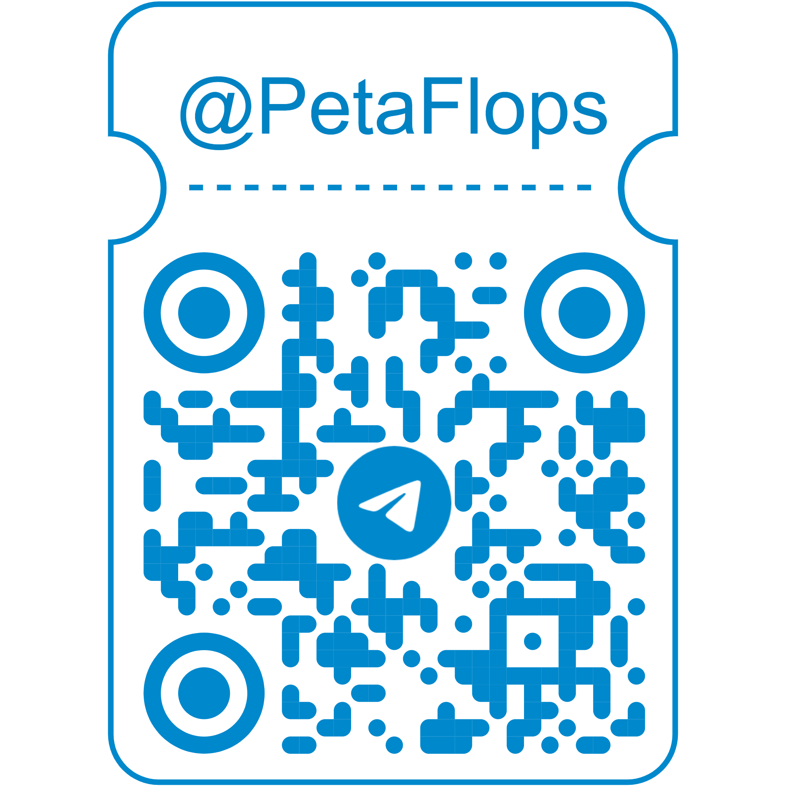

ИГПР сочетает лучшие черты современных практик с уникальной гибкостью, делая проект адаптивным, эффективным и конкурентоспособным. Она не просто следует трендам — она устанавливает их.

## 💵 Выгода, Польза и Достижения
Методика ИГПР призвана оптимизировать и улучшить различные аспекты управления проектами и бизнес-процессами. В зависимости от роли, каждый руководитель высшего звена компании может извлечь определенную пользу от ее применения. [[metod/Позиции и обретения|Позиции и обретения]].

## 📈 Экономическая Целесообразность
ИГПР минимизирует риски, сокращает временные и финансовые затраты и увеличивает окупаемость инвестиций (ROI) и капитализацию. [[promo/ekonomika-i-hrematistica-v-it|Экономика в ИТ.]]

## 🔢 12 Этапов Процесса Развития
От идеи до внедрения и обратной связи. Каждый этап устроен так, чтобы обеспечить максимальное значение производительности и минимальные риски.

На каждом этапе генерируются конкретные, измеримые результаты, позволяющие быстро адаптироваться и реагировать на потребности рынка. [[metod/Этапные продукты|Этапные продукты.]]

## 📊 Самооценка Конкурентноспособности
Время — это наиболее ценный ресурс. Зачем тратить его на исправление ошибок, когда можно сосредоточиться на инновациях? 

Методика ИГПР помогает командам достичь 100% производительности, минимизируя ошибки и сохраняя высший рейтинг приложений. [[metod/Самооценка Конкурентноспособности|Начать.]]

## 📱Контакт

Если вы хотите связаться со мной в Telegram, просто отсканируйте следующий QR-код или нажмите на него, чтобы открыть мой профиль напрямую

