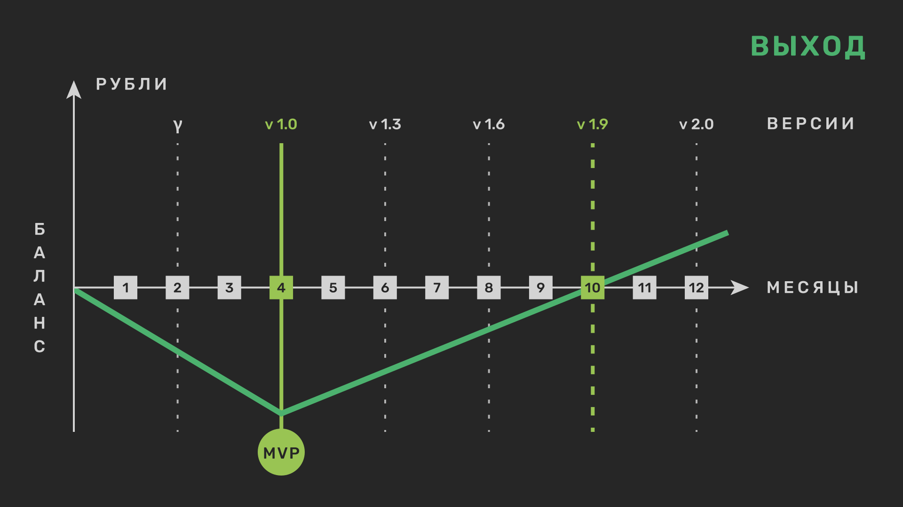

🔗 [[12 шагов/index|12 этапов процесса развития ПО]] отражаются в 4-х ключевых фазах воспроизводства:

- **Распределение**: [[12 шагов/01. Формализация|01. Формализация]] ➔ [[12 шагов/02. Проектирование|02. Проектирование]] ➔ [[12 шагов/03. Планирование|03. Планирование]]
- **Производство**: [[04. Кодирование|04. Кодирование]] ➔ [[05. Сборка|05. Сборка]] ➔ [[06. Испытания|06. Испытания]]
- **Обмен**: [[07. Выпуск|07. Выпуск]] ➔ [[08. Поставка|08. Поставка]] ➔ [[10. Мониторинг|10. Мониторинг]]
- **Потребление**: [[09. Эксплуатация|09. Эксплуатация]] ➔ [[11. Обучение|11. Обучение]] ➔ [[12. Отзывы|12. Отзывы]]

📊 Осознание баланса между стоимостью создания и стоимостью владения - вот ваш ключ к успешным инвестициям.

  <svg id="main_diagram" width="100%" height="100%" preserveAspectRatio="xMidYMid meet"></svg>

🔍 **Ожидание VS Реальность**: Многие проекты сталкиваются с проблемами из-за технического долга, неправильного управления и отсутствия компетенции. Наша цель - изменить этот сценарий.

![[ojidanie.svg]] ➔ ![[realnost.svg]] ➔ 

**Сделайте первый шаг к успешному инвестированию:**

1️⃣ [[Самодиагностика|Оцените]] текущую ситуацию вашего проекта.
2️⃣ Внедрите нашу уникальную [методику](/).  
3️⃣ Наблюдайте за прогрессом, используя наши доклады и аналитику.
